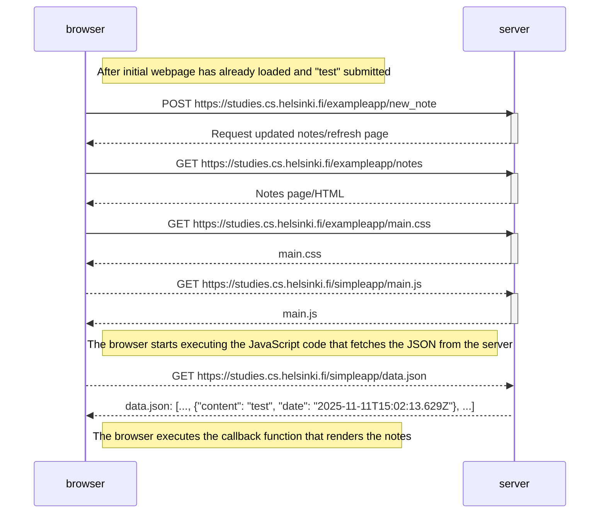

# Exercise 0 - New Note Diagram
[Exercise Link](https://fullstackopen.com/en/part0/fundamentals_of_web_apps#exercises-0-1-0-6:~:text=0.4%3A%20New%20note%20diagram)

```mermaid
    sequenceDiagram
        participant browser
        participant server

        Note right of browser: After initial webpage has already loaded and "test" submitted

        browser->>server: POST https://studies.cs.helsinki.fi/exampleapp/new_note
        activate server
        server-->>browser: Request updated notes/refresh page
        deactivate server

        browser->>server: GET https://studies.cs.helsinki.fi/exampleapp/notes
        activate server
        server-->>browser: Notes page/HTML
        deactivate server

        browser->>server: GET https://studies.cs.helsinki.fi/exampleapp/main.css
        activate server
        server-->>browser: main.css
        deactivate server

        browser-->>server: GET https://studies.cs.helsinki.fi/simpleapp/main.js
        activate server
        server-->>browser: main.js
        deactivate server

        Note right of browser: The browser starts executing the JavaScript code that fetches the JSON from the server

        browser-->>server: GET https://studies.cs.helsinki.fi/simpleapp/data.json
        activate server
        server-->>browser: data.json: [..., {"content": "test", "date": "2025-11-11T15:02:13.629Z"}, ...]

        Note right of browser: The browser executes the callback function that renders the notes


```