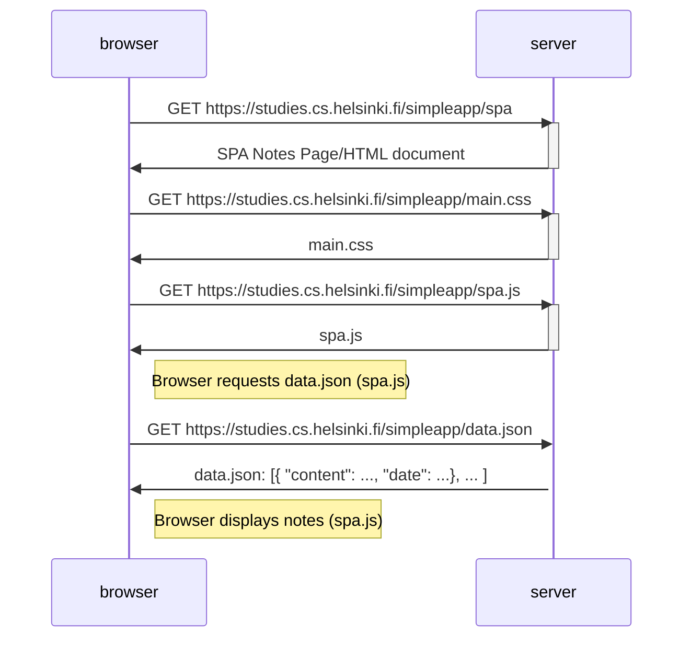

# Exercise 0.5 - Single Page App Diagram
[Exercise Link](https://fullstackopen.com/en/part0/fundamentals_of_web_apps#exercises-0-1-0-6:~:text=0.5%3A%20Single%20page%20app%20diagram)

```mermaid
    sequenceDiagram
        participant browser
        participant server

        browser->>server: GET https://studies.cs.helsinki.fi/simpleapp/spa
        activate server
        server->>browser: SPA Notes Page/HTML document
        deactivate server

        browser->>server: GET https://studies.cs.helsinki.fi/simpleapp/main.css
        activate server
        server->>browser: main.css
        deactivate server

        browser->>server: GET https://studies.cs.helsinki.fi/simpleapp/spa.js
        activate server
        server->>browser: spa.js
        deactivate server

        Note right of browser: Browser requests data.json (spa.js)

        browser->>server: GET https://studies.cs.helsinki.fi/simpleapp/data.json
        activate server
        server->>browser: data.json: [{ "content": ..., "date": ...}, ... ]

        Note right of browser: Browser displays notes (spa.js)
```