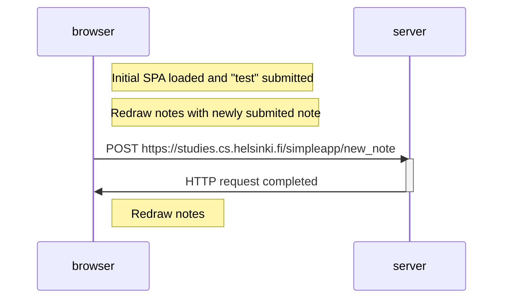

# Exercise 0.6 - New Note in Single Page App Diagram
[Exercise Link](https://fullstackopen.com/en/part0/fundamentals_of_web_apps#:~:text=0.6:%20New%20note%20in%20Single%20page%20app%20diagram)

```mermaid
    sequenceDiagram
        participant browser
        participant server

        Note right of browser: Initial SPA loaded and "test" submitted

        Note right of browser: Redraw notes with newly submited note

        browser->>server: POST https://studies.cs.helsinki.fi/simpleapp/new_note
        activate server
        server->>browser: HTTP request completed
        deactivate server

        Note right of browser: Redraw notes
```